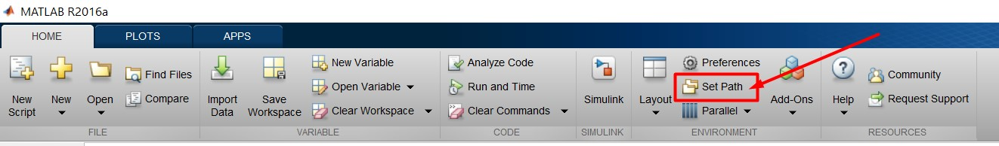

# m-script-generator

## About

Having your m-files documented in a standard way (or at all!) is very useful for sharing code between projects, and between people. The trouble is, clicking File -> New -> Function doesn't give you much to go on, and it is very easy to be lackadaisical about writing thorough and consistent documentation.

GenerateFunctionMFile() creates a new untitled m-file with placeholder documentation, and opens the file in the editor.

GenerateFunctionMFile(true), works as above but prompts you for the name of the function.

The layout includes $Author, $Date and $Revision tags, which are automatically completed for you. If you use CVS or SVN as your version control system, then checking in your file will automatically cause these fields to be updated.

Since typing is a lot of effort, also included is a function called "new", which is a wrapper for GenerateFunctionMFile(true), so all you need to do to create a new file with documentation is type new, and the function name. Easy!

Note: You'll probably want to play with the template of the created m-file to suit your own needs. (At the very least, you'll want to change the copyright line to that of your own company.)

## Build

First, you need to Set Path to your project with lib.

After that write *new* in *Command Window*.

Write the name of function and get the result.

